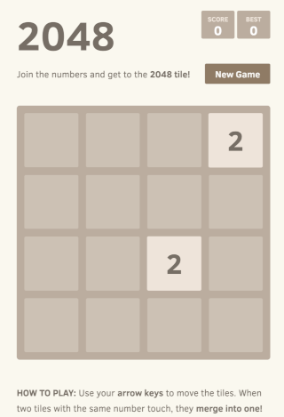

# Overview

Sample javascript application implementing the classic [2048 game](https://en.wikipedia.org/wiki/2048_(video_game)). Main project is based on the [game-2048 library](https://www.npmjs.com/package/game-2048) and [Webpack](https://webpack.js.org).

## Requirements  
node 16

## Building the 2048 Game Application

Main project is `javascript` based, hence you can build the application via `npm`:

```shell
npm install --include=dev

npm run build
```

You can test the application locally, by running below command:

```shell
npm start
```

Above command will start a web server in development mode, which you can access at [localhost:8080](http://localhost:8080). Please visit the main library [configuration](https://www.npmjs.com/package/game-2048#config) section from the public npm registry to see all available options.

Open a web browser and point to [localhost:8080](http://localhost:8080/). You should see the `game-2048` welcome page:


